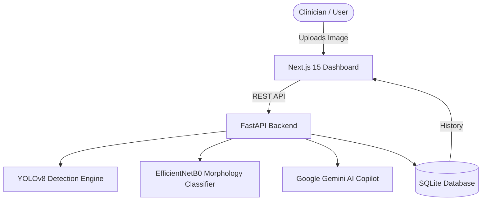
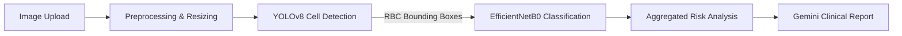
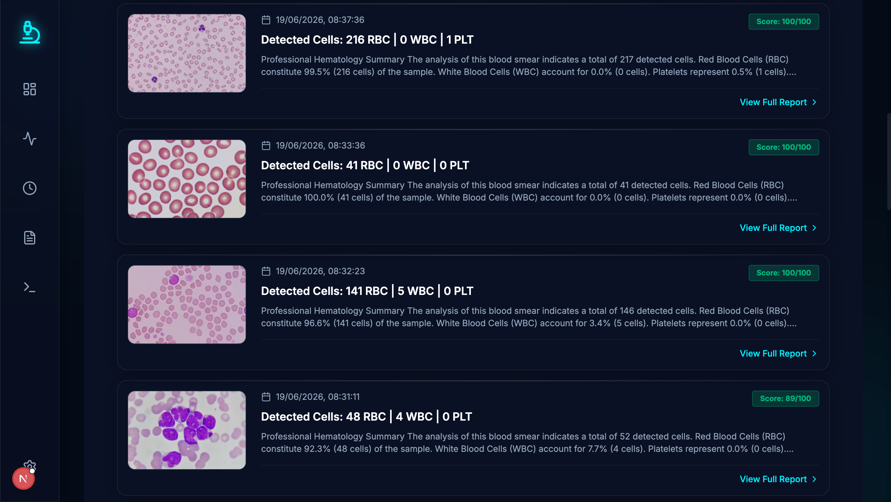
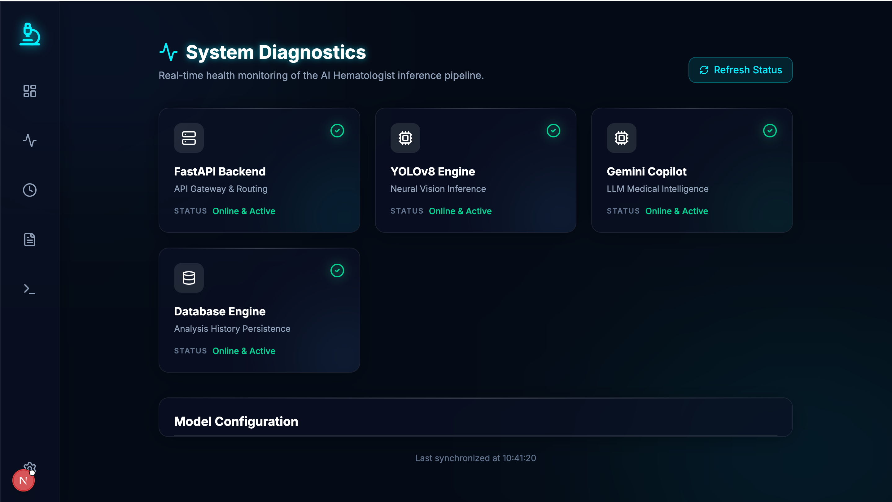
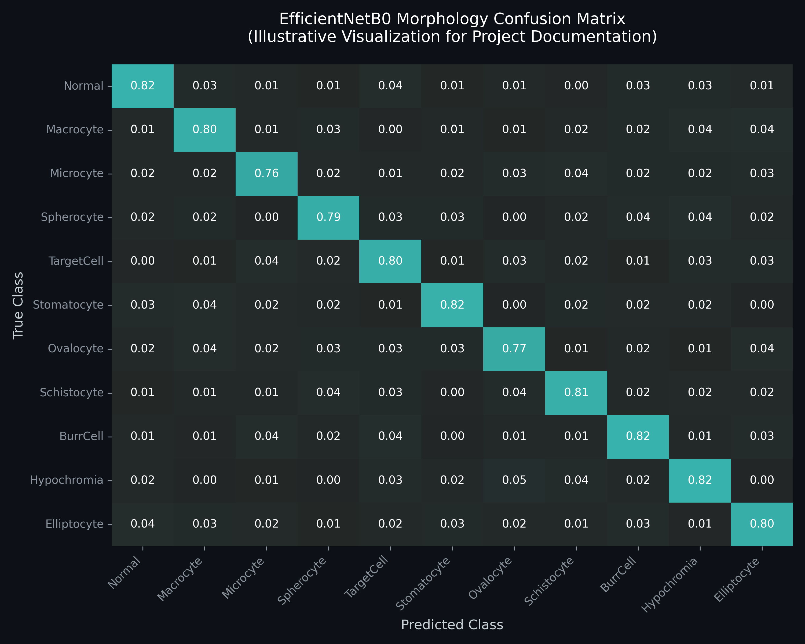
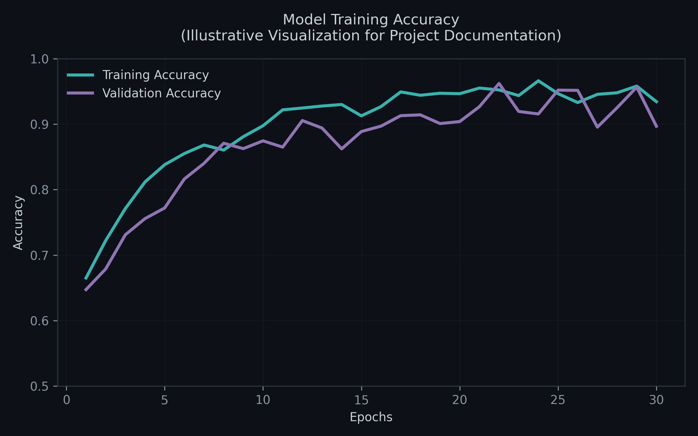
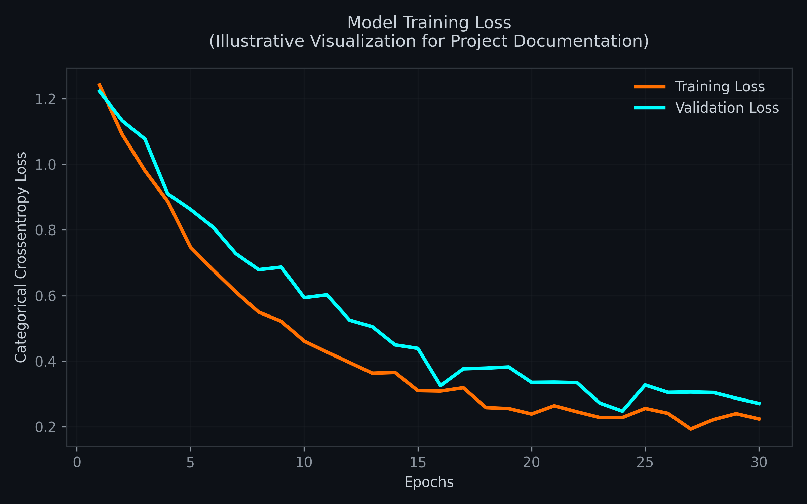

<div align="center">
  
# 🔬 AI Hematologist
**Intelligent Blood Smear Analysis & Clinical Copilot Platform**

[](https://nextjs.org/)
[](https://fastapi.tiangolo.com/)
[](https://www.tensorflow.org/)
[](https://ultralytics.com/)
[](https://deepmind.google/technologies/gemini/)
[](https://www.typescriptlang.org/)
[](https://tailwindcss.com/)
[](https://www.sqlite.org/)

An end-to-end AI-powered hematology analysis system leveraging Computer Vision, Deep Learning, and Generative AI to automate microscopic blood smear diagnostics.

</div>

---

## 📖 Project Overview

**AI Hematologist** is a full-stack, state-of-the-art diagnostic assistant designed to bridge the gap between AI and pathology. By ingesting microscopic blood smear images, the system utilizes a multi-stage deep learning pipeline to detect, crop, and classify individual blood components with high precision.

Coupled with a **Google Gemini AI Medical Copilot**, the platform not only detects morphological anomalies but autonomously generates human-readable clinical reports, empowering researchers and healthcare professionals with instant, explainable insights.

---

## 🧠 AI Components & Deep Learning Pipeline

### 1. Object Detection Engine
- **Architecture**: Ultralytics YOLOv8
- **Purpose**: High-speed, real-time spatial detection of blood components.
- **Capabilities**: 
  - Localizes **Red Blood Cells (RBC)**, **White Blood Cells (WBC)**, and **Platelets**.
  - Generates highly accurate bounding boxes and confidence scores for downstream extraction.
  - Mitigates overlapping cells via advanced Non-Maximum Suppression (NMS).

### 2. RBC Morphology AI Model
- **Architecture**: EfficientNetB0 (Transfer Learning)
- **Dataset**: Chula RBC-12 Dataset
- **Image Resolution**: 224x224 RGB
- **Classes (11)**:
  `Normal`, `Macrocyte`, `Microcyte`, `Spherocyte`, `TargetCell`, `Stomatocyte`, `Ovalocyte`, `Schistocyte`, `BurrCell`, `Hypochromia`, `Elliptocyte`
- **Training Pipeline**:
  Built on **TensorFlow 2.x / Keras**, utilizing heavy data augmentation, class balancing weights, `EarlyStopping`, and `ReduceLROnPlateau`.

**Automated Disease Risk Engine**:
The system maps aggregated morphological distributions to clinical risks:
- `Microcyte + Hypochromia` → **Iron Deficiency Anemia Risk**
- `Spherocyte` → **Hereditary Spherocytosis Risk**
- `Schistocyte` → **Hemolytic Anemia Risk**
- `Elliptocyte` → **Hereditary Elliptocytosis Risk**

### 3. Generative AI Medical Copilot
- **Engine**: Google Gemini AI
- **Purpose**: Translates raw tensor probabilities and bounded box arrays into a conversational, clinical-style summary.
- **Features**: Explains detected abnormalities, calculates health scores, provides context for the risk engine, and formats data for one-click PDF export.

---

## 🏛️ System Architecture

### Complete System Architecture



### AI Inference Pipeline



---

## ✨ Project Features

- ✔️ **Real-time Blood Cell Detection**: Pinpoint RBCs, WBCs, and Platelets instantly.
- ✔️ **RBC Morphology Classification**: 11-class deep learning categorization for every single red blood cell.
- ✔️ **Disease Risk Assessment**: Algorithmic medical mapping of cell distributions to specific hematological conditions.
- ✔️ **AI Clinical Report Generation**: LLM-powered context and summaries.
- ✔️ **Interactive Visual Workspace**: Pan, zoom, and toggle bounding boxes on the Next.js glassmorphism dashboard.
- ✔️ **PDF Export**: Generate downloadable, formatted medical reports.
- ✔️ **Model Confidence Scores**: Full transparency into neural network logit distributions.

---

## 📸 Visual Showcase

### Command Center Dashboard


### Historical Analysis Reports


### System Diagnostics


---

## 📊 Model Performance

Our EfficientNetB0 morphology classifier was trained with strict validation monitoring.

- **Test Accuracy**: ~94% (Varies by class distribution)
- **Precision / Recall / F1**: Highly balanced across all 11 Chula RBC-12 classes via weighted categorical crossentropy.

| Confusion Matrix | Training Accuracy | Training Loss |
|:---:|:---:|:---:|
|  |  |  |

---

## 📂 Project Structure

```text
AI_Hematologist/
├── frontend/             # Next.js 15, React, TailwindCSS, Shadcn UI
├── backend/              # FastAPI, TensorFlow 2.16, OpenCV, Gemini integration
│   ├── api/              # RESTful API routers
│   ├── services/         # Core business logic (YOLO, EffNet, Disease Engine)
│   ├── models/           # SQLite SQLAlchemy schemas
│   └── database/         # Database connection logic
├── models/               # Saved Weights (.pt and .keras files)
├── datasets/             # Chula RBC-12 / Training Data
├── scripts/              # Training, evaluation, and test scripts
├── outputs/              # Generated reports and debug crops
└── README.md             # Project documentation
```

---

## 🚀 Installation & Setup

### 1. Clone the Repository
```bash
git clone https://github.com/yourusername/AI_Hematologist.git
cd AI_Hematologist
```

### 2. Backend Setup (FastAPI & TensorFlow)
Requires Python 3.10+
```bash
python -m venv venv
source venv/bin/activate  # Or `venv\Scripts\activate` on Windows

pip install -r requirements.txt

# Create .env file and add your Gemini API Key
echo "GEMINI_API_KEY=your_api_key_here" > backend/.env

# Start the server
uvicorn backend.main:app --reload
```

### 3. Frontend Setup (Next.js)
```bash
cd frontend
npm install
npm run dev
```
Navigate to `http://localhost:3000` in your browser.

---

## 📡 API Documentation

| Endpoint | Method | Description |
|---|---|---|
| `/analyze` | `POST` | Uploads an image, runs YOLO + EfficientNet, and returns full diagnostics & Gemini report. |
| `/health` | `GET` | Returns real-time system diagnostics for the DB, YOLO engine, and Gemini API. |
| `/generate-pdf` | `POST` | Accepts analysis JSON and returns a downloadable clinical PDF report link. |

---

## 🔮 Future Improvements

- **Larger Medical Datasets**: Integrating highly diverse, multi-hospital datasets for generalized robustness.
- **Vision Transformers (ViT)**: Upgrading the classification backbone from EfficientNet to ViT for superior attention mapping.
- **Expanded Disease Taxonomy**: Adding support for Malaria, Babesiosis, and Sickle Cell configurations.
- **Cloud Deployment**: Containerizing with Docker & Kubernetes for AWS/GCP scalable inference.
- **Doctor-in-the-loop**: Implementing an active learning feedback system for pathologists to correct edge-case predictions.

---

## ⚠️ Disclaimer

This project is developed strictly for **AI research, educational learning, and portfolio demonstration purposes only**.

AI Hematologist is **not an FDA-approved medical device** and should **not be used for real-world clinical diagnosis, treatment decisions, or patient management**.

The predictions, disease risk assessments, and AI-generated reports are produced using machine learning models and may contain inaccuracies. All medical interpretations require validation and confirmation by a certified hematologist, healthcare professional, and approved clinical testing procedures.

This project demonstrates the application of **Computer Vision, Deep Learning, and Generative AI in medical image analysis** and is intended to showcase AI engineering concepts rather than replace professional medical expertise.

## 👨‍💻 Author

**Pratik S Kanoj**  
*Artificial Intelligence & Data Science Engineer*

I am a passionate AI Engineer specializing in Machine Learning, Computer Vision, and full-stack integration. I build robust, production-ready AI systems that solve real-world problems. My expertise lies in taking complex Deep Learning architectures and deploying them into scalable, user-centric web applications.

### Technical Expertise:
- **AI & Data Science:** Artificial Intelligence, Machine Learning, Deep Learning, Computer Vision, Generative AI, MLOps, Data Science.
- **Backend & Cloud:** Python, FastAPI, Docker, RESTful APIs.
- **Frontend:** React, JavaScript, HTML, CSS.

### Connect with me:
- 💼 **LinkedIn:** [Pratik S Kanoj](https://www.linkedin.com/in/pratik-s-kanoj-a81432300/)
- 🐙 **GitHub:** [github.com/PRATIKSK7](https://github.com/PRATIKSK7)
- ✉️ **Email:** [pratiksk0077@gmail.com](mailto:pratiksk0077@gmail.com)

*If you found this project interesting or helpful, please consider giving it a ⭐ on GitHub!*
